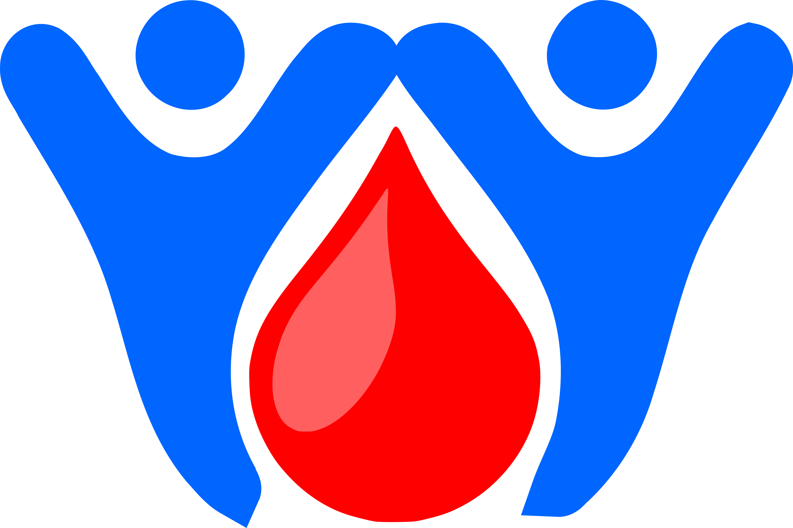
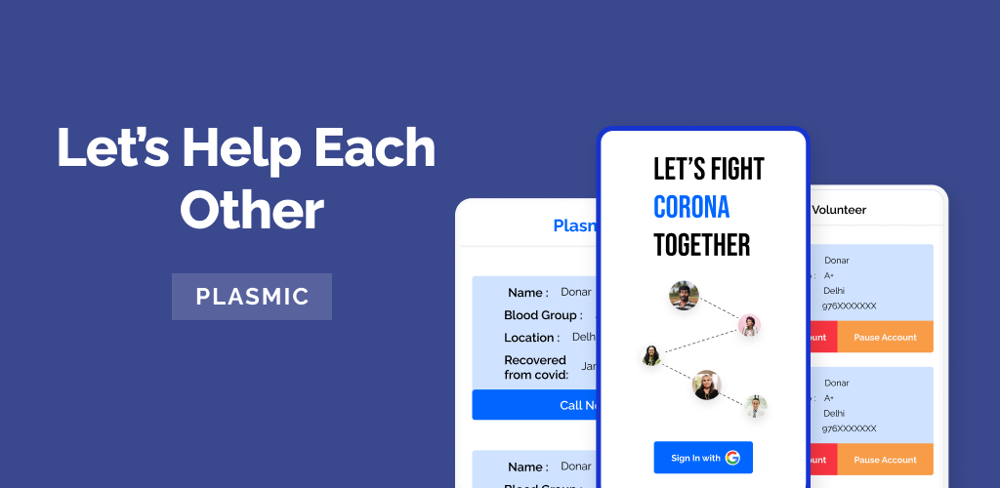
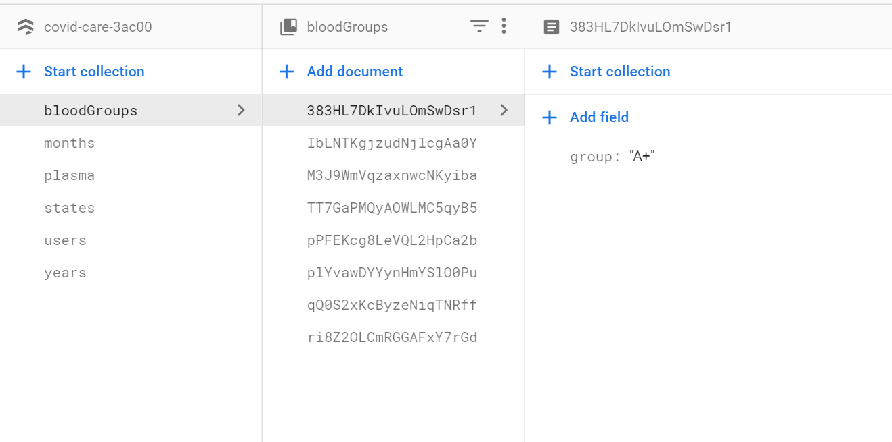
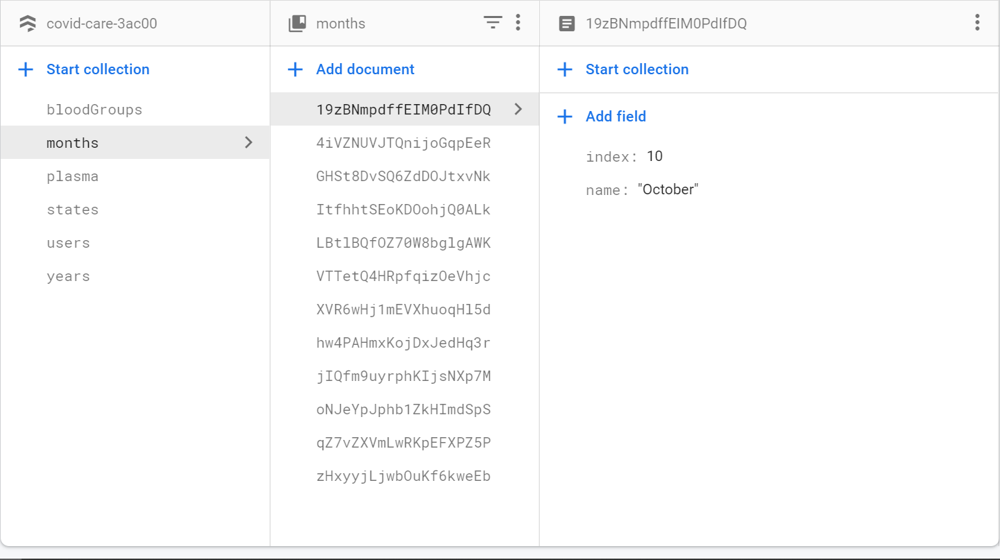

#  Plasmic

Mobile application to help plasma donors and plasma receivers at one place.

## Getting Started

Technology Used:

- Flutter : To get started with flutter head over to https://flutter.dev
- Firebase : To learn how to integrate firebase with flutter head over to https://firebase.flutter.dev/docs/overview

Major Packages

- `provider`
- `cloud_firestore`
- `firebase_auth`
- `firebase_core`
- `google_sign_in`

## How to get started with this project

Make a new project on firebase and add a new application with these details:

- package name: `com.visnstudios.covid_care`

- open cmd/terminal and navigate to this project and enter `gradlew signingReport` and copy the `SHA-1` to firebase

- download `google-services.json` and paste it under `android/app` directory

- run `pub get` to get all dependencies

- Open firebase console

  - navigate to authentication and enable `google signin`

  - navigate to firestore and enable it

  - make a collections called `bloodGroups` and add a doc with auto id and its data in this format

    `{ group: "A+" }`

    

- make a collections called `months` and add a doc with auto id and its data in this format

  `{ name: "January" , index : 1 }`

  

- similarly make a collections called `states` and `years` and add a doc with auto id and its data in this format

  `{ name: "State Name" }` this format is for state

  `{ title: "2020"}` this format is for years

If you are stuck at any point, you can always email me at thisisamank@gmail.com and I will me more than happy to help you with it 😀

## TODO:

- Customize DropdownMenu widget to use local data instead of firebase streams to make dropdown